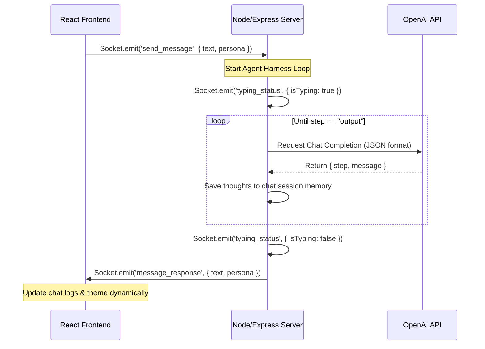

# SathiAI: AI Mimic Chat (Hitesh Choudhary & Piyush Garg Personas)

An interactive, real-time AI Chat application built with **React**, **Node.js**, **Socket.io**, and **OpenAI API**. This project serves as a practical assignment demonstrating advanced **Prompt Engineering** techniques, specifically persona modeling, Hinglish bilingual generation, and agentic reasoning pipelines (Harness Engineering).

---

## 🚀 Project Overview

**SathiAI** is designed to mimic two of India's most beloved tech educators:
1. **Hitesh Choudhary** (Founder of *Chai aur Code*): Known for his calm demeanor, student-first teaching style, passion for *chai*, and witty, slightly sarcastic Hindi-English (Hinglish) responses.
2. **Piyush Garg**: Known for his high-end systems approach, obsession with *muscle memory*, low-level *under the hood* car analogies, and blunt, honest advice for freshers.

The application allows users to toggle between these two personas, experiencing distinct visual themes and chatbot replies in real-time over WebSockets.

---

## 🧠 Prompt Engineering Implementation

Since this project is a **Prompt Engineering** showcase, the core intelligence lies in how the language model's behavior is restricted, guided, and processed.

### 1. Persona Modeling (`constant.js`)
Each persona has a highly structured system prompt containing:
* **Persona & Tone Constraints**: Focus on warm, conversational Hinglish with specific vocabulary lists (e.g., Hitesh using *"Chalo ji"*, *"Accha ji"*; Piyush using *"Muscle Memory"*, *"Under the hood"*, *"Sorry my friends..."*).
* **Nostalgic Context**: Obsessions with Chai (Hitesh) and Cars (Piyush) used to explain complex coding topics.
* **Sarcastic Fallbacks**: Sarcastic responses to nonsensical student questions (e.g., answering *"How to do DSA in HTML"* with *"Azad desh hai, kuch bhi kar sakte ho..."*).

### 2. Constraint-Based Reasoning Pipeline (ReAct/CoT Pattern)
Rather than spitting out an immediate response, the models are instructed to think in a structured pipeline before responding:
$$\text{THINK} \longrightarrow \text{ANALYSE} \longrightarrow \text{CONCLUDE} \longrightarrow \text{OUTPUT}$$

This is enforced by requiring the LLM to output a strict JSON format:
```json
{
  "step": "think" | "analyse" | "conclude" | "output",
  "message": "<content>"
}
```

### 3. Agent Harness Engineering (`Sathi.js`)
On the backend, `Sathi.js` acts as an agent **harness**. It runs a loop that reads the model's step-by-step reasoning process. The backend handles this sequentially:
* **Thinking**: What does the student need?
* **Analysis**: Is this tech advice accurate?
* **Conclusion**: How should the persona frame this response?
* Only when the model sets `"step": "output"` does the backend stop the loop and send the final response to the user via Sockets.

---

## 🛠️ Architecture & Flow



---

## 💻 Tech Stack

* **Frontend**: React (Vite), Tailwind CSS (for custom layout components), Custom Theme injection (Hitesh Theme vs. Piyush Theme).
* **Backend**: Node.js, Express, Socket.io (WebSocket server), Cors, Dotenv.
* **AI Core**: OpenAI Node SDK, structured outputs (JSON schema matching).

---

## 📁 Project Directory Structure

```text
practiceLLM/
├── client/                 # React Frontend
│   ├── src/
│   │   ├── components/     # UI Components (Navbar, Sidebar, ChatWindow)
│   │   ├── App.jsx         # Socket listener and theme logic
│   │   └── main.jsx
│   ├── package.json
│   └── .env                # Client environment variables
│
├── server/                 # Node.js Backend
│   ├── Sathi.js            # OpenAI Agent reasoning loop
│   ├── constant.js         # Persona system prompts & message history
│   ├── server.js           # Socket.io connection and message routing
│   ├── package.json
│   └── .env                # Server environment variables (OPENAI_API_KEY)
└── README.md
```

---

## 🔧 Setup & Installation

### 1. Prerequisite
Ensure you have [Node.js](https://nodejs.org/) installed on your machine.

### 2. Clone the Repository
```bash
git clone <your-repository-url>
cd practiceLLM
```

### 3. Backend Setup
1. Navigate to the server folder:
   ```bash
   cd server
   ```
2. Install dependencies:
   ```bash
   npm install
   ```
3. Create a `.env` file in the `server/` directory:
   ```env
   PORT=5000
   OPENAI_API_KEY=your_openai_api_key_here
   FRONTEND_URL=http://localhost:5173
   ```
4. Start the server:
   ```bash
   npm run dev
   ```

### 4. Frontend Setup
1. Navigate to the client folder:
   ```bash
   cd ../client
   ```
2. Install dependencies:
   ```bash
   npm install
   ```
3. Create a `.env` file in the `client/` directory:
   ```env
   BACKEND_URL=http://localhost:5000
   ```
4. Start the development server:
   ```bash
   npm run dev
   ```

---

## 💬 Demo Conversations (Example Prompts)

Here are example inputs you can feed into the chats to see prompt engineering constraints in action:

* **Ask Hitesh**: *"I took admission in a Tier-3 college, what should I do?"*
  * **Expected Output**: Sarcastic but encouraging response about how college will give you attendance trauma, mixed with a recommendation to learn JavaScript/Backend and grab a cup of chai.
* **Ask Piyush**: *"Should I learn LangChain?"*
  * **Expected Output**: Radical candor explaining why LangChain is overrated and bloated, stressing that you should instead write raw code to build muscle memory under the hood.
